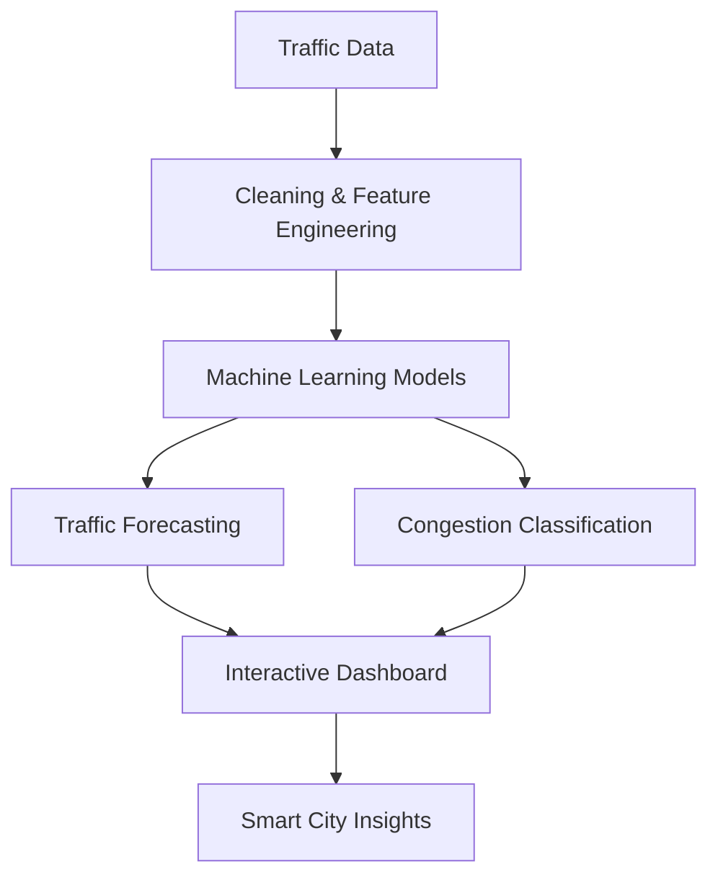

# 🌆 AI Smart City Intelligence System

<div align="center">

### Futuristic traffic intelligence for smarter cities


<p>


</p>


</div>

---

## Overview

The **AI Smart City Intelligence System** is an AI-powered traffic monitoring, congestion analysis, and forecasting platform designed to transform urban traffic data into actionable insight.

It combines machine learning, deep learning, and interactive visualization to explore:

- traffic volume patterns
- congestion behavior
- time-based demand shifts
- junction-level movement trends
- forecasting signals for future planning

<table align="center">
  <tr>
    <td align="center"><strong>Predict</strong><br/>Traffic demand ahead of time</td>
    <td align="center"><strong>Detect</strong><br/>Congestion levels in real time</td>
    <td align="center"><strong>Visualize</strong><br/>Patterns across time and location</td>
    <td align="center"><strong>Plan</strong><br/>Support smarter city decisions</td>
  </tr>
</table>

---

## Core Features

| Capability | What it does |
| --- | --- |
| Traffic Forecasting | Predicts future traffic volume using machine learning and sequence modeling. |
| Congestion Classification | Categorizes traffic into low, medium, and high congestion states. |
| Interactive Dashboard | Provides filters, charts, predictions, and exploration panels with Streamlit. |
| Heatmap Intelligence | Shows traffic intensity by time, weekday, and junction behavior. |
| Trend Analysis | Breaks down hourly, daily, monthly, and weekday traffic movement. |
| Dataset Preview | Lets you inspect filtered traffic records directly from the app. |

---

## Visual Snapshot

<p align="center">


</p>

<p align="center">

</p>

---

## Tech Stack

### Languages

<p align="center">

</p>

### Data Science and ML

<p align="center">

</p>

<p align="center">


</p>

### BI and Analytics

<p align="center">

</p>

---

## Featured Projects

<p align="center">

<a href="https://github.com/Sumit-Agnihotri/Zomato-Data-Analysis"></a>
<a href="https://github.com/Sumit-Agnihotri/INDIA_JOB_MARKET_PROJECT"></a>
<a href="https://github.com/Sumit-Agnihotri/MILITARY_EXPENDITURE_ANALYSIS"></a>
<a href="https://github.com/Sumit-Agnihotri/Customer-Churn-Analysis"></a>
<a href="https://github.com/Sumit-Agnihotri/TITANIC_SURVIVAL_PREDICTION"></a>
<a href="https://github.com/Sumit-Agnihotri/MOVIE_RATING_PREDICTION"></a>
<a href="https://github.com/Sumit-Agnihotri/IRIS_FLOWER_CLASSIFICATION"></a>

</p>

---

## Intelligence Layer

<div align="center">



</div>

### Models Used

- **Random Forest Regressor** for traffic volume prediction
- **XGBoost Regressor** for stronger forecasting experiments
- **TensorFlow LSTM** for sequence-based traffic prediction
- **Random Forest Classifier** for congestion classification

### Why these models

- good fit for tabular and time-series traffic patterns
- strong baseline and ensemble performance
- handles non-linear relationships well
- supports both prediction and classification workflows

---

## Dashboard Experience

The dashboard is designed like a live control room for city traffic analysis.

<table>
  <tr>
    <td><strong>🚦 Traffic by Hour</strong><br/>Line charts for hourly movement patterns.</td>
    <td><strong>📈 Daily Trend</strong><br/>Tracks how traffic changes across the day cycle.</td>
  </tr>
  <tr>
    <td><strong>🚗 Vehicle Distribution</strong><br/>Histogram views for traffic volume spread.</td>
    <td><strong>📅 Weekday Analysis</strong><br/>Compares traffic across weekdays.</td>
  </tr>
  <tr>
    <td><strong>📆 Monthly Trend</strong><br/>Shows longer-term traffic movement.</td>
    <td><strong>🔥 Heatmap Layers</strong><br/>Highlights traffic density clusters visually.</td>
  </tr>
</table>

---

## Architecture

```text
User Input
    ↓
Dashboard Filters
    ↓
Feature Engineering
    ↓
Machine Learning Models
    ↓
Prediction System
    ↓
Interactive Visualizations
    ↓
Traffic Insights
```

---

## Project Goals

- build a complete end-to-end AI project
- practice practical machine learning workflows
- create deployable AI dashboards
- simulate real-world smart city analytics
- build a portfolio-ready application
- understand traffic pattern analysis using AI

---

## Connect

<p align="center">

<a href="mailto:sagnihotri9710@gmail.com"></a>
<a href="https://www.linkedin.com/in/sumit-agnihotri/"></a>

</p>

---

## Quote

> “Without data, you're just another person with an opinion.” – W. Edwards Deming

---

<div align="center">


⭐ If you like this project, consider starring the repositories that inspired it. ⭐

</div>
